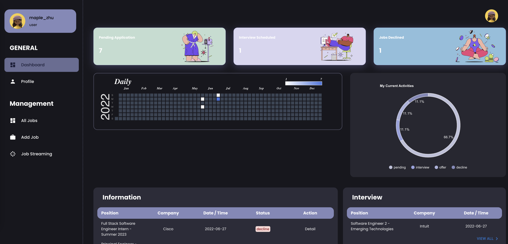

# Job Landing Board

*Help job seekers land their dream job*

[Visit the Website](https://job-landing-client-iteration3.herokuapp.com/)

Teams: 
- Zanyuan Yang
- Siheng Wei
- Maple Feng Zhu

## Demo

## App Introduction

Getting a job is no easy task, especially with tight competition and increased challenges during the application and
recruitment process.

- It takes **21 to 80 job applications** to get one job offer, on average.
- 61.7% of job seekers get at least one interview by sending between **1-10 job applications**.
- 51% of job seekers receive a job offer after having **3 job interviews**.

The jobs apply for are scattered all over the place (Indeed, LinkedIn, email, personal meetings, etc),
making it hard to remember where we've applied and where we stand with each opportunity.

This is a tool to help user track and organize job search that offers one place to keep all of those jobs and all the
information related to them.

## Langing Page

This page is a brief introduction of our app, displaying user comments and a action page for register

    

## Dashboard

This page shows a glance of overall applications the user currently have. 

    

## All Job Tracking Page

This page will allow login user to search their saved job by filter

    

## Job Add Page

This page will allow login user add position they just applied and keep tracking in the future.

    

## Profile Page

This is user profile information.

    

