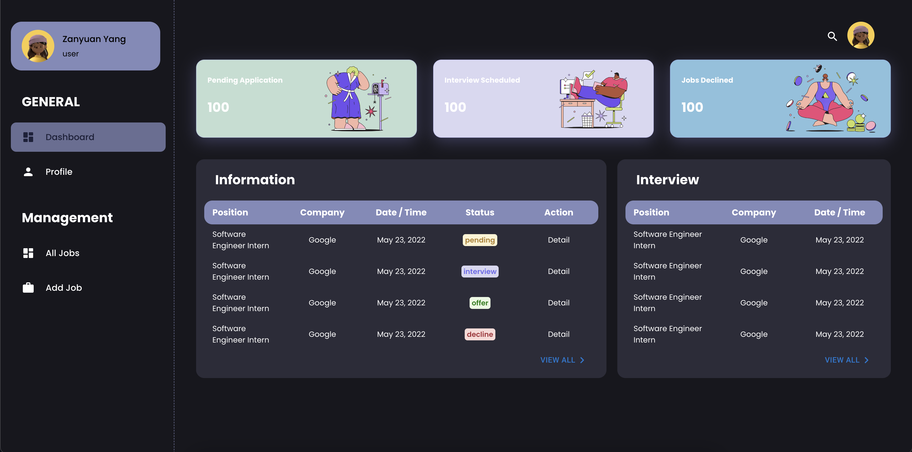

# Job Landing Board

*Help job seekers land their dream job*

Teams: 
- Zanyuan Yang
- Siheng Wei
- Maple Feng Zhu

## Iteration 2 Update
- [X] DashBoard UI Contents < *Jaying* >
    - [X] Page Layout
    - [X] Animation
    - [X] Add relavent pictures
- [ ] Link the Back-end Data to DashBoard < *Maple* >
- [X] Add Profile Editing Page
- [ ] push to heroku

Branch Status:
- add dashboard v2.0 pages

DashBoard includes the following pages:
- DashTable
- All Jobs Display
- Add Job
- User Profile

Expected Layout

    

